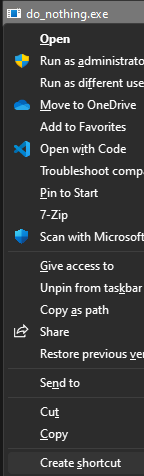
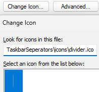
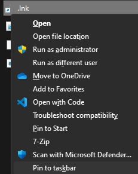

# WinTaskbarSeperators
Seperator icons for Windows taskbar.

## 1. Generate shortcut
### Automatically
1. Read an understand what this script does.
   - Never just run random code from the internet.
1. Open [PowerShell](https://learn.microsoft.com/en-us/powershell/scripting/windows-powershell/starting-windows-powershell) terminal.
1. Navigate to this directory.
1. Run the script:
   - `.\divider.ps1`
   - If got `cannot be loaded because running scripts is disabled on this system.` error
     - Run `Get-ExecutionPolicy` to get current execution policy.
     - Run `Set-ExecutionPolicy -Scope CurrentUser Unrestricted`
     - Remember to run `Set-ExecutionPolicy -Scope CurrentUser` with result that you got with Get-ExecutionPolicy after running this script.
    ```poweshell
    PS C:\WinTaskbarSeperators> Get-ExecutionPolicy -Scope CurrentUser
    Restricted
    PS C:\WinTaskbarSeperators> Set-ExecutionPolicy -Scope CurrentUser Unrestricted
    PS C:\WinTaskbarSeperators> .\divider.ps1
    Shortcut for divider created: C:\Users\Sante\Projects\WinTaskbarSeperators\scripts\..\.lnk
    Move it to safe location and pin it to taskbar.
    PS C:\WinTaskbarSeperators> Set-ExecutionPolicy -Scope CurrentUser Restricted
    ```
### Manually
1. Generate shortcut to [program\do_nothing.exe](program\do_nothing.exe).
   - 
1. Set icon to [icons\divider.ico](icons\divider.ico).
   - 
1. Set name to ALT code 0160
   - Keep ALT pressed and type 0160

## 2. Pin shortcut to taskbar
1. Open full right click menu
   - SHIFT + Right click
   - OR
   - Right click + Show more options
1. Click Pin to taskbar.
   - 
- If you want more seperator, then just copy existing one and add another ALT0160 charather to name.
   - Keep ALT pressed and type 0160